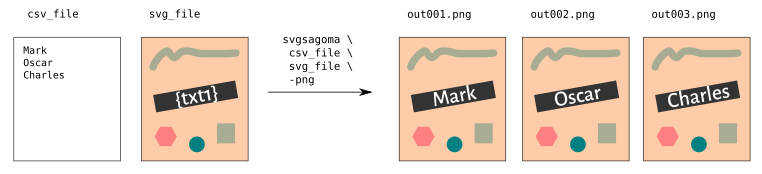
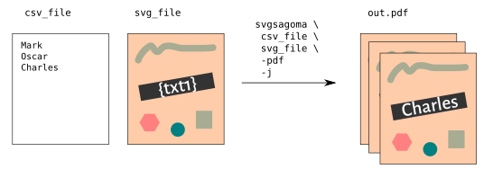
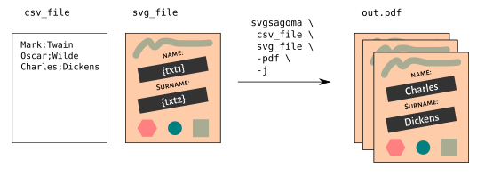
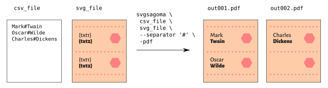
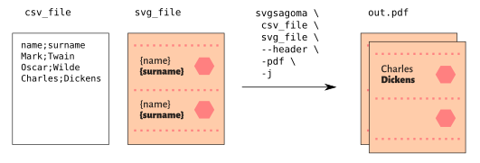

# svgsagoma
A simple templating engine to substitute placeholders in a svg file with values taken
from a csv file and exporting in various formats.

## Syntax

    usage: svgsagoma.py [-h] [-d D] [-j] [--separator SEPARATOR] [--header]
                        (-png | -pdf)
                        csv_file svg_file [out_prefix]
    
    Replace values and export images from an svg file
    
    positional arguments:
      csv_file              input text file in csv format
      svg_file              input svg file
      out_prefix            prefix for output file(s) (default: 'out')
    
    optional arguments:
      -h, --help            show this help message and exit
      -d D                  set dpi quality (default: 300)
      -j                    join output files as a multipage pdf
      --separator SEPARATOR
                            separator character in the csv file (default: ';')
      --header              name the placeholders according to the first line of
                            the csv file (default: 'txt1' ... 'txtN')
      -png                  export as png
      -pdf                  export as pdf (default)

## Examples

* One record per line, one placeholder, export as multiple png images.

> Placeholders always have to be put in **curly brackets**. In this case the placeholder
> reads `{txt1}`, as it is the first (and only) record.

* One record per line, one placeholder, export as one unique pdf.

> The `-j` parameter is used to *join* all resulting images in a unique multipage
> pdf file. You can still use the `-png` switch to rasterize the images before.
> In this example, though, the vector data is preserved by using the `-pdf` switch.

* Multiple records per line, one placeholder per record, export as one unique pdf.

> Same as the example above, but with multiple records. Every page of the resulting pdf
> will represent a recordset.

* Multiple records per line, placeholders for multiple recordsets, export as pdf files,
custom separator

> Each output file will contain data from multiple recordsets. Remaning unconsumed
placeholders, if any, will be left blank (i.e. cleared).
> The `--separator` parameter is used to specify the hash symbol `#` as separator
> instead of `;`.

* Multiple records per line, placeholders for multiple recordsets, export as one unique pdf,
read field names from file

> Same as the example above, but outputs a unique pdf.
> The `--header` parameter is used to read the field names from the first line of the
> csv file and the placeholders in the svg are named accordingly.

## Dependencies

*svgsagoma* is written in python and relies on the following dependencies:

* inkscape
* pdfunite
* convert (imagemagick)
